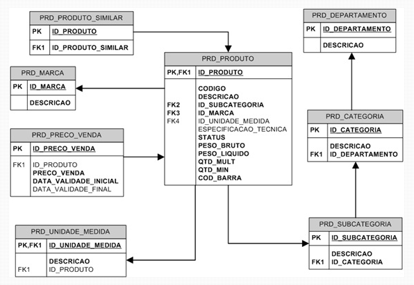

# Diagramas entidade relacionamento (DER)
- Uma abstração da parte do sistema a ser desenvolvido. O diagrama possui entidades e seus relacionamentos.
- *Exemplo:*

- O DER é a representação gráfica do MER (Modelo Entidade-Relacionamento). O MER diz que a exepressão da realidade se baseia no relacionamento entre as entidades 

## Entidades
- São objetos do mundo real que podem ser represantados no DER como tabelas, que possuem os atributos. 
    - Chave Primária (PK)
        - Valor sempre será único.
        - Não pode ser nulo.
        - A Chave primária é única.
        - Não pode ser alterada.
- Entidades Fortes
- Entidades Fracas
- Entidades Associativas
    - Chave estrangeira (FK)
        - Referencia uma chave primária de uma tabela em outra tabela.